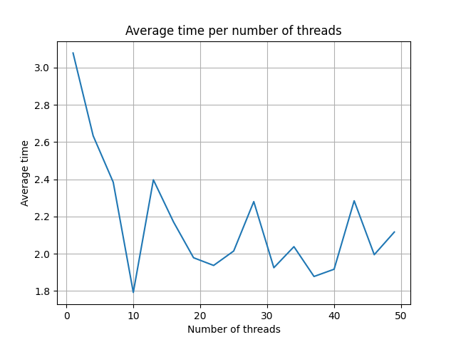

# Simple Blockchain Simulation #

This project is a simple simulation of a blockchain with Proof of Work in Python. The simulation runs on a 
single local machine, where miners are simulated with threads working on the shared blockchain. 

The goal of this project is to deepen my understanding of blockchain technology and PoW.
It is important to note that this is just a simple simulation. This code  does not encompass all the 
complexities and nuances of real-world blockchain systems.

### How It Works ###

The simulation follows a basic blockchain architecture. Each block in the chain contains a list of transactions, 
and miners compete to solve a cryptographic puzzle to add a new block to the chain. 
The Proof of Work algorithm ensures that the puzzle-solving process requires significant computational effort.

### optimal amount of threads/miners ###
I tested this simulation with various numbers of miners (=threads) to determine the optimum.
The graph below shows the result of the average time taken per number of threads:

Based on this graph, the optimal amount of miners on my machine (MacBook Pro M1) is 10.